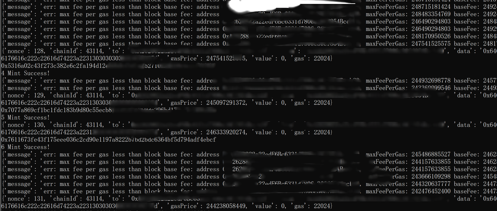
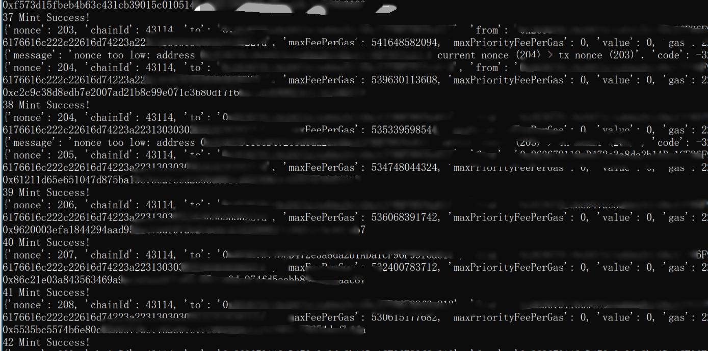

# avalMint(EIP1559_fixed)
asc-20 aval automated minting script. Building upon the original version, this script addresses and resolves issues caused by EIP1559, specifically eliminating the error message: "err: max fee per gas less than block base fee." This enhancement significantly improves efficiency. Previously, there might be a 90% failure rate out of 100 attempts, but now it's 100% successful.


This script is also compatible with other EVM chains and requires modification in three places.

- Change RPC: Find the `rpc_url = "https://avalanche.drpc.org"` in the code, open chainlist.org to view available RPC nodes, and replace it accordingly.
- Modify chainId: Locate `'chainId': 43114` in the code, and replace it with the chainId corresponding to the chain from chainlist.org.
- Modify tx data: Find `'data':'0x646174613a2c7b2270223a226173632d3230222c226f70223a226d696e74222c227469636b223a226176616c222c22616d74223a22313030303030303030227d'` in the code. Use utf8-hex.py to convert the mint string and replace it.


## Before Fix



## After Fix




## About aval (asc-20)
aval, the asc-20 token, has a total supply of 21 trillion, with the same number of tokens as pols (21 million). The AVAX chain infrastructure is complete, outperforming both the OK chain and the Huobi HT chain. There is the potential to create another miracle like pols. The next time you see this paragraph, it will be in the archived records of some group chat. Cost: 0.0xu-0.1x.

aval (asc-20) Data Dashboard (for reference only):
Data format: `data:,{"p":"asc-20","op":"mint","tick":"aval","amt":"100000000"}`

Hexadecimal: `0x646174613a2c7b2270223a226173632d3230222c226f70223a226d696e74222c227469636b223a226176616c222c22616d74223a22313030303030303030227d`

Refer to more RPC nodes: [https://chainlist.org/?search=val](https://chainlist.org/?search=val), to find faster RPC nodes in your region. Of course, you can also ignore this and use the nodes directly in the code, as I have already configured them.

Block Explorer: [https://snowtrace.io](https://snowtrace.io), to check the quantity of minted tokens at your address and the current gas fees.


## Initial Preparation
1. Transfer ETH to a CEX (Binance, Mexc, OKX, etc.).
2. Sell ETH for USDT.
3. Buy AVAX, and after 64 confirmations, withdraw to the MetaMask wallet.
4. Configure the required number of bots.
5. Then, proceed with the script below.


## Installation Process

### Step 1 Download  python 3.10.6
https://www.python.org/downloads/windows/

Open the webpage and scroll down to:

​	Download Windows installer (32-bit)

​	Download Windows installer (64-bit)

Download the version that matches your computer's system (64-bit for 64-bit systems, 32-bit for 32-bit systems).

### Step Double-click to execute the installation, and make sure to check the option to add Python to the system environment variables. 

Verify the installation:

```bash
E:\avalMint\bot1>python --version
Python 3.10.6
```

### Step Update pip

```bash
E:\avalMint\bot1>python -m pip install --upgrade pip
```

### Step Install the required packages

```bash
E:\avalMint\bot1>pip install web3==5.31.1
E:\avalMint\bot1>pip install python-dotenv
```

### Step Write the wallet address and private key to .env

### Step Run the script

```bash
E:\avalMint\bot1>python mint.py
```


